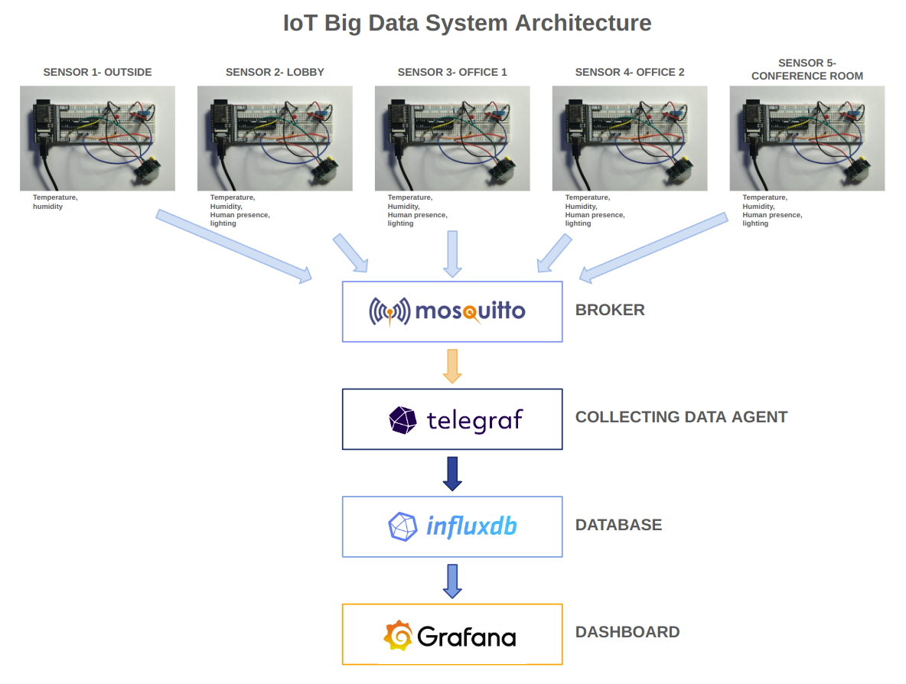
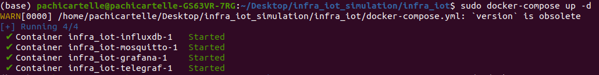
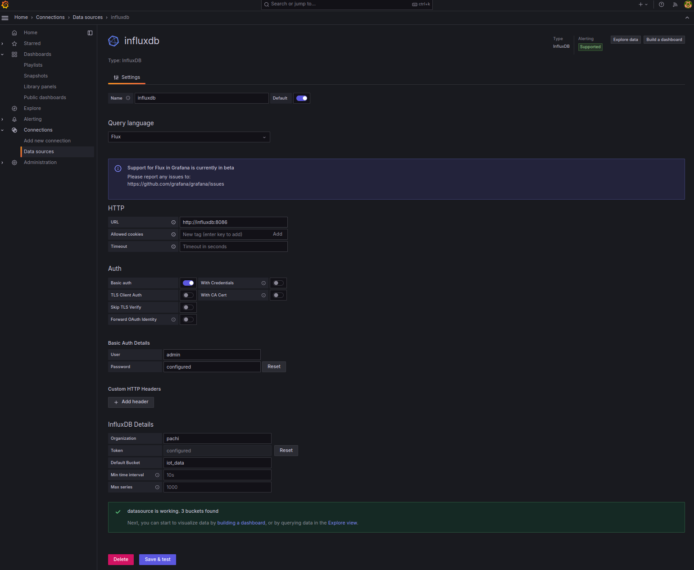
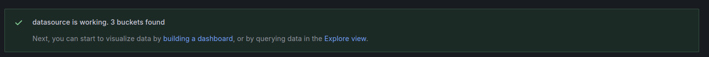
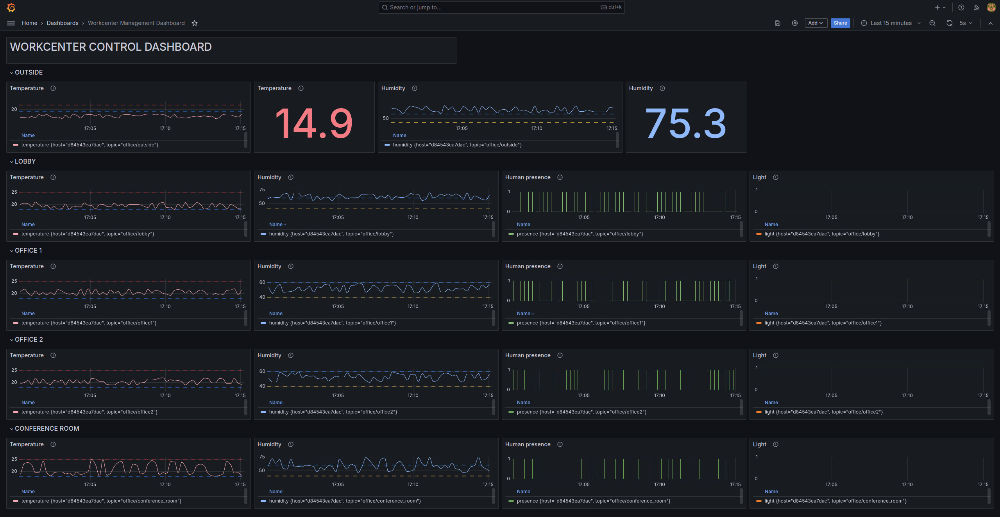
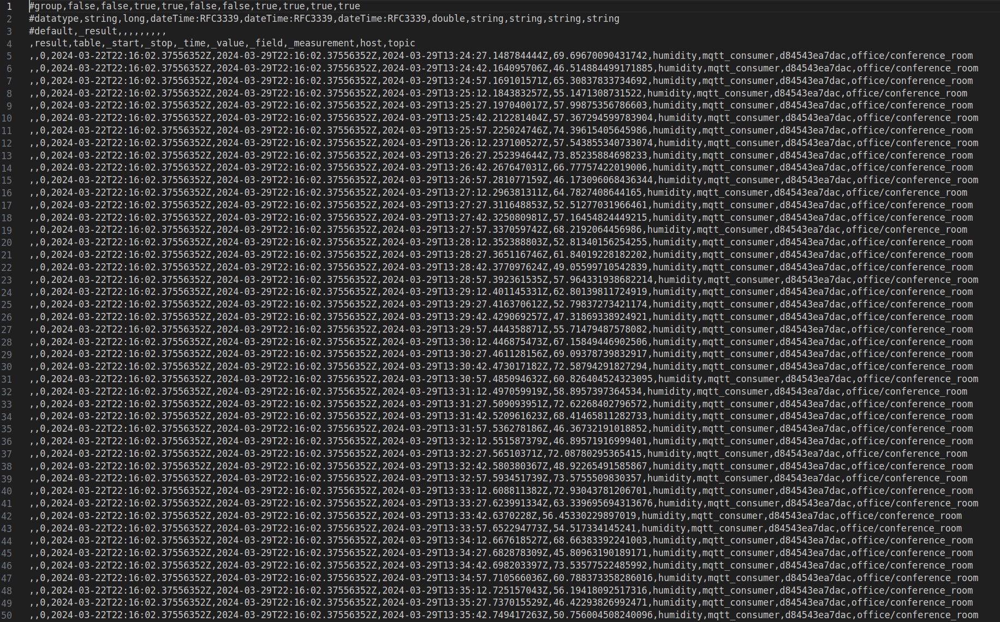
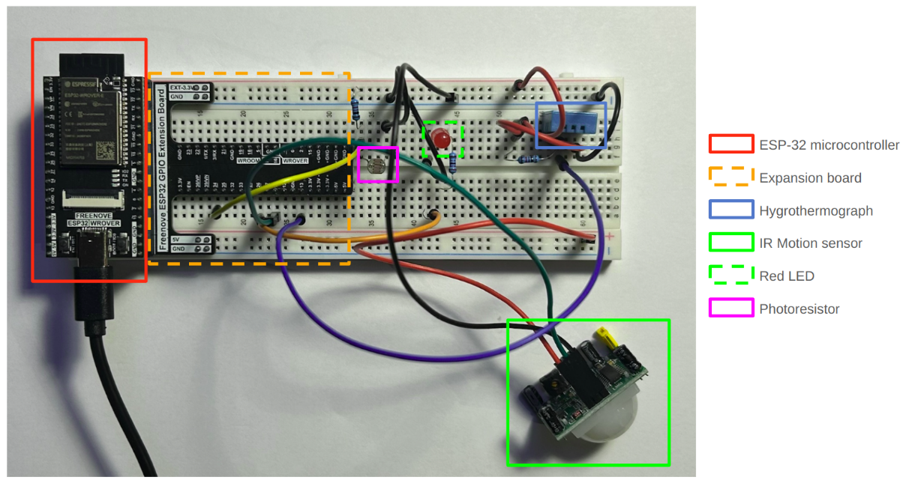
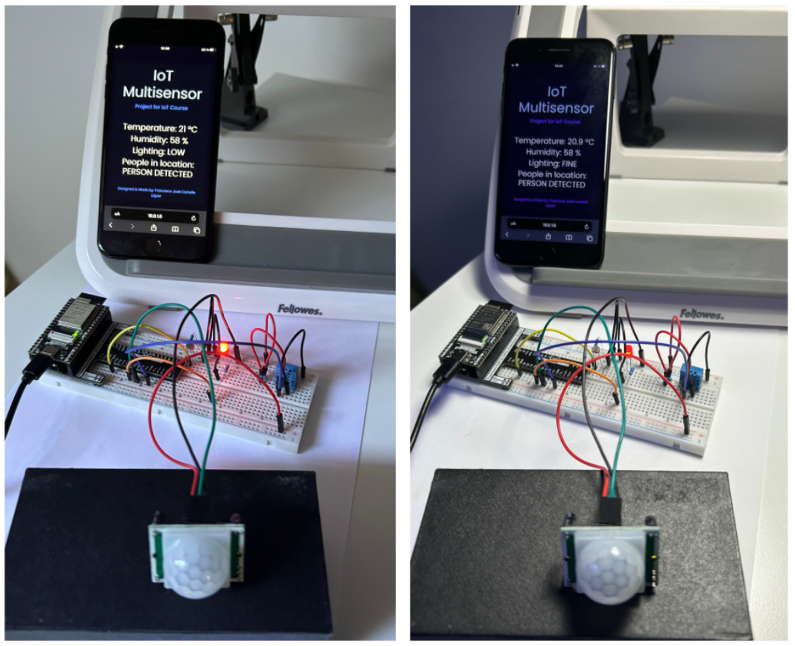

## IOT BIG DATA WORKCENTER INFRASTRUCTURE

### Table of contents-index

- [Introduction](#intro)
- [Components of the system](#components)
- [Docker images](#docker)
- [Installation](#installation)
- [Downloading the influxdb database](#downloading_database)
- [Closing the system](#closing)
- [Next steps](#next_steps)


### Introduction <a name='intro'></a>

This repository contains all the necessary resources for defining, configuring and running the needed infrastructure for a **IoT Big Data monitoring system** for monitoting a simulated **Workcenter building composed of a lobby, two offices and a conference room**.

With this system, we get the information from each of the sensors distributed in the environment, that is:

- Temperature and humidity from the exterior of the building.

- Temperature, humidity, human precense and lighting in each of the rooms that compose the workcenter: lobby, office 1, office 2 and conference room.

The temperature is expressed in Celsius degrees, the humidity in %, the human presence is 0 if no people is detected in a given room and 1 if we have people there; and regarding the light conditions, 0 expresses poor light conditions (and in consecuence we need to turn on lights) and 1 expresses good light conditions.

This information is displayed in a Dashboard where we can visualize the values for room and measurement and check if they are inside desired values (horizontal dashed lines).


### Components of the system <a name='components'></a>

The IoT Big Data System has the next components:

- **Sensors**: that get information of the environment regarding the temperature, humidity, human precense and lighting. These sensors are crucial for real-time data gathering, enabling the system to respond to environmental changes instantly.

- **MQTT Broker**:  a message broker that utilizes the MQTT protocol (Message Queuing Telemetry Transport, is a lightweight, publish-subscribe network protocol that transports messages between devices. It is designed for low-bandwidth, high-latency or unreliable networks and it is particularly suitable for remote communication scenarios where a small code footprint is required and/or network bandwidth is at a premium). This MQTT broker is essential for device communication within an IoT system, facilitating the efficient and reliable exchange of messages between devices and the server. As MQTT broker we use **mosquitto-eclipse**.

- **Telegraf**: a plugin-driven server agent from InfluxData for collecting and sending metrics and events from databases, systems, and IoT sensors. Telegraf is designed to minimize memory usage and support plugins to collect data from a wide variety of sources.

- **InfluxDB Database**: a time series database designed to handle high write and query loads. It is an ideal database for storing and analyzing IoT sensor data, financial transactions, application metrics, and other time-stamped data.

- **Grafana**: a platform for query, visualization, and alerting on metrics and logs wherever they are stored. It allows to create, explore, and share dashboards that visualize real-time data and track over time, making it easier to understand complex data from InfluxDB and other data sources.


The relation between these components is showed in the next schema:




### Docker images and code<a name='docker'></a>

For simulating the data from the sensors we use the **publisher.py** code file that generates this data:

- **Outside Temperature**: The script calculates the temperature for the **outside** environment based on the time of day, mimicking the natural variation in temperature as the day progresses. For instance, during what might be typical daytime hours (10 AM to 7 PM), it selects a random temperature between 10°C and 15°C, representing a milder climate. As evening sets in (7 PM to midnight), the temperature drops to a range between 7°C and 10°C, and for the late night to early morning hours (midnight to 10 AM), it generates a temperature between 5°C and 8°C, simulating the cooler part of the day.

- **Outside Humidity**: For humidity outdoors, the script uses a random value between 60% and 80%.

- **Indoor Temperature and Humidity**: Indoors, the temperature and humidity levels are more controlled and less subject to the wide fluctuations seen outdoors, bacause of the use of climate control systems. These variables are computed with:

    - In general indoor spaces like the **lobby**, it simulates a comfortable temperature range between 18°C and 21°C with humidity levels between 55% and 70%.

    - In office spaces like **office1** and **office2**, it chooses a temperature between 19°C and 22°C and humidity from 45% to 60%, reflecting typical conditions maintained in office environments.

    - For the **conference_room**, the presence of people influences the environment due to body heat and respiration. Therefore, when the script simulates the presence of people (presence == 1), it selects higher temperature and humidity ranges (22°C to 25°C and 55% to 75%, respectively). If no one is present, it opts for a cooler and drier environment (18°C to 20°C and 45% to 60% humidity).

This data is continuosly published in an infinite loop at regular intervals of 15 seconds, in a JSON object message containing the room identifier, and the current values for temperature, humidity, light, and presence. The simulated sensor data is sent to a specific **MQTT topic** that corresponds to each room, using a topic structure like **office/room_name**.

For the rest of components we have used [Docker](https://www.docker.com/) images available in [Docker Hub](https://hub.docker.com/), as they are Open Source resources:

- [Eclipse Mosquitto](https://mosquitto.org/), in this [eclipse-mosquitto docker image](https://hub.docker.com/_/eclipse-mosquitto)

- [Telegraf](https://www.influxdata.com/time-series-platform/telegraf/), in this [telegraf docker image](https://hub.docker.com/_/telegraf)

- [InfluxDB](https://www.influxdata.com/), in this [influxdb database docker image](https://hub.docker.com/_/influxdb)

- [Grafana](https://grafana.com/), in this [grafana docker image](https://hub.docker.com/r/grafana/grafana)


We also use the **consumer.py** code file as a data listener within our IoT ecosystem, that it continuously monitors messages received in the MQTT broker from various sensors in different rooms. It is used for checking that all messages from the publisher are passing through the broker.


### Installation and system running <a name='installation'></a>

First, we need to clone this repository in our local machine:

```
git clone https://github.com/PachiCartelle/iot_bigdata_infrastructure.git
```

The code downloaded contains the folder **infra-iot**, so we cd inside it

```
$ cd infra-iot
```

Then, there we have the **grafana-data** and **influxdb-data** folders.

For Grafana working fine, we need to run this code, to have permissions:

```
$ sudo chown -R 472:472 grafana-data

$ sudo chmod -R 775 grafana-data
```

Then, we need to run the mosquitto, telegraf, influxdb and grafana Docker containers, using our **docker-compose.yml** file:

```
$ sudo docker-compose up -d
```

, and we obtain one container running for each one of the elements of our system: mosquitto, telegraf, influxdb and grafana:




After that, we need to get the **influxdb token**, so we enter in our browser [http://localhost:8086/](http://localhost:8086/)

,and enter our data:

username: YOUR INFLUXDB USERNAME

password: YOUR INFLUXDB PASSWORD

organization: YOUR ORGANIZATION NAME

bucket_name: YOUR BUCKET NAME NAME

, after that, **influxdb** give us our **token**, that we enter in **telegraf.conf** file:

```
[agent]
  interval = "10s"
  round_interval = true
  metric_batch_size = 1000
  metric_buffer_limit = 10000
  collection_jitter = "0s"
  flush_interval = "10s"
  flush_jitter = "0s"
  precision = ""
  debug = false
  quiet = false
  logfile = ""
  hostname = ""
  omit_hostname = false

[[outputs.influxdb_v2]] 
  urls = ["http://influxdb:8086"]
  token = "YOUR INFLUXDB TOKEN"
  organization = "YOUR ORGANIZATION NAME"
  bucket = "YOUR BUCKET NAME"

[[outputs.file]]
  files = ["stdout", "/tmp/metrics.out"]

[[inputs.mqtt_consumer]]
  servers = ["tcp://mosquitto:1883"]
  topics = [
    "office/#"
  ]
  data_format = "json"

```

, and then we restart **telegraf**:

```
$ sudo docker-compose restart telegraf
```

, once we have all the infrastructure ready, we need to create the data from the sensors (simulate the data from the sensors) on another terminal screen:

```
$ python multiple_publisher.py
```

, and we can check that it is passed to the broker, reading the messages of the broker on another terminal screen with:

```
$ python consumer.py
```

Finally, after all that, we go to **grafana main page** in [http://localhost:3000/](http://localhost:3000/)

admin

admin

In **grafana** first task is adding **influxdb** as datasourse, so we need to go to **Connections > Data Sources > Add data source > influxdb**, and configure influxdb settings inside grafana:

Name: influxdb

Query language: Flux

HTTP URL: http://influxdb:8086

Basic Auth Details User: admin

Basic Auth Details Password: admin

InfluxDB Details Organization: YOUR ORGANIZATION NAME

InfluxDB Details Token: YOUR INFLUXDB TOKEN

InfluxDB Details Default Bucket: YOUR BUCKET NAME



, and click **Save & Test** button.

If we have confirmation like this:



, interaction between **influxdb** and **grafana** is configured and we can visualize the **streamed sensor data in grafana**.

For this we need to configure a **grafana Dashboard** or import one already defined.

For this example, we are going to use a previous configured Dashboard, so in the grafana left menu, we choose Dashboards and in the upper menu click on:

**+ > Import Dashboard**

, and upload the **dashboard_workcenter.json** file from our repository.

The final **output of the Dashboard** is:




### Downloading the influx database <a name='downloading_database'></a>

For downloading the influxdb database from the influxdb running container, we need to enter in influxdb container:

```
$ sudo docker exec -it infra_iot-influxdb-1 /bin/bash
```

, then we have to export the database to a csv file with the command:


```
# influx query 'from(bucket: "YOUR BUCKET NAME") |> range(start: -7d) |> filter(fn: (r) => r._measurement == "mqtt_consumer" and (r._field == "temperature" or r._field == "humidity" or r._field == "presence" or r._field == "light"))' --org "YOUR ORG NAME" --token "YOUR INGLUXDB TOKEN" --raw > influxdb_data.csv
```

, then exit the container

```
# exit
```

, and copy the **influxdb_data.csv** file in local

```
$ sudo docker cp INFLUXDB_ID_CONTAINER:/influxdb_data.csv .
```

, we can visualize some rows of the database:




### Closing the system <a name='closing'></a>

In case we want to close the system and delete all containers, we should type in terminal:

```
$ sudo docker-compose down
```

### Next steps <a name='next_steps'></a>

The system described uses data from simulated sensors generated with the **publisher.py** file.

The next obvious step is using real data from real sensors inside this system, that could be:

- A data stream obtained from internet sources.

- Data generated from real sensors, like this ESP32 prototype built for the **IoT course**, that mesasures temperature, humidity, human presence and lighting:






Next steps will be applying this system to another **Digital Twins** domains with different data and exploring all the representation and displaying possibilities of Grafana.
